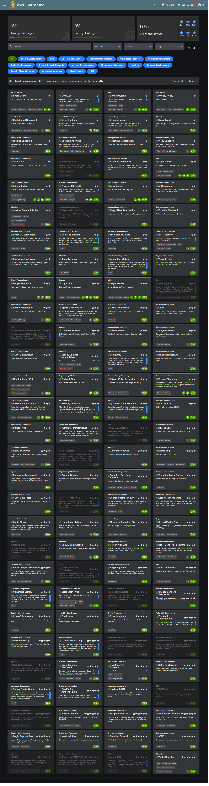

# OWASP Juice Shop – Web Application Security Labs

## Overview

This repository documents my hands-on cybersecurity practice using OWASP Juice Shop, an intentionally vulnerable web application used for learning and practicing web application security.

All testing was performed in a controlled local lab environment.

## Objective

The objective of this project is to develop practical skills in identifying, analyzing, and understanding common web application security vulnerabilities.

## Security Areas Practiced

- Broken Access Control
- Authentication & Authorization
- Input Validation
- Sensitive Data Exposure
- File Upload Security
- Business Logic Vulnerabilities
- CAPTCHA / Anti-Automation
- Error Handling
- Security Misconfiguration
- Information Disclosure

## Tools Used

- OWASP Juice Shop
- Burp Suite
- Browser Developer Tools
- Docker

## Hands-on Practice

I have completed multiple OWASP Juice Shop challenges covering different web application security concepts.

### Key Topics

**Authentication**
- Login security
- Password reset security
- Authentication weaknesses

**Access Control**
- Unauthorized access
- Authorization testing
- Privilege-related issues

**Input Validation**
- Improper input handling
- File handling
- Special-character/input manipulation

**Sensitive Data Exposure**
- Exposed files
- Information disclosure
- Sensitive information handling

**Business Logic**
- Transaction and application logic testing
- Improper validation of application behavior

## Learning Outcomes

Through these labs, I developed practical understanding of:

- How common web vulnerabilities work
- How to analyze application behavior
- How to test authentication and authorization controls
- How improper input validation can create security issues
- How sensitive information can be exposed
- How security controls can fail when improperly implemented

## Environment

OWASP Juice Shop was run in a local controlled environment for educational and authorized security testing.

## Evidence

OWASP Juice Shop challenge progress:

## Disclaimer

This documentation is for educational purposes. All testing was performed in an authorized local lab environment. No unauthorized testing was performed against real-world systems.
